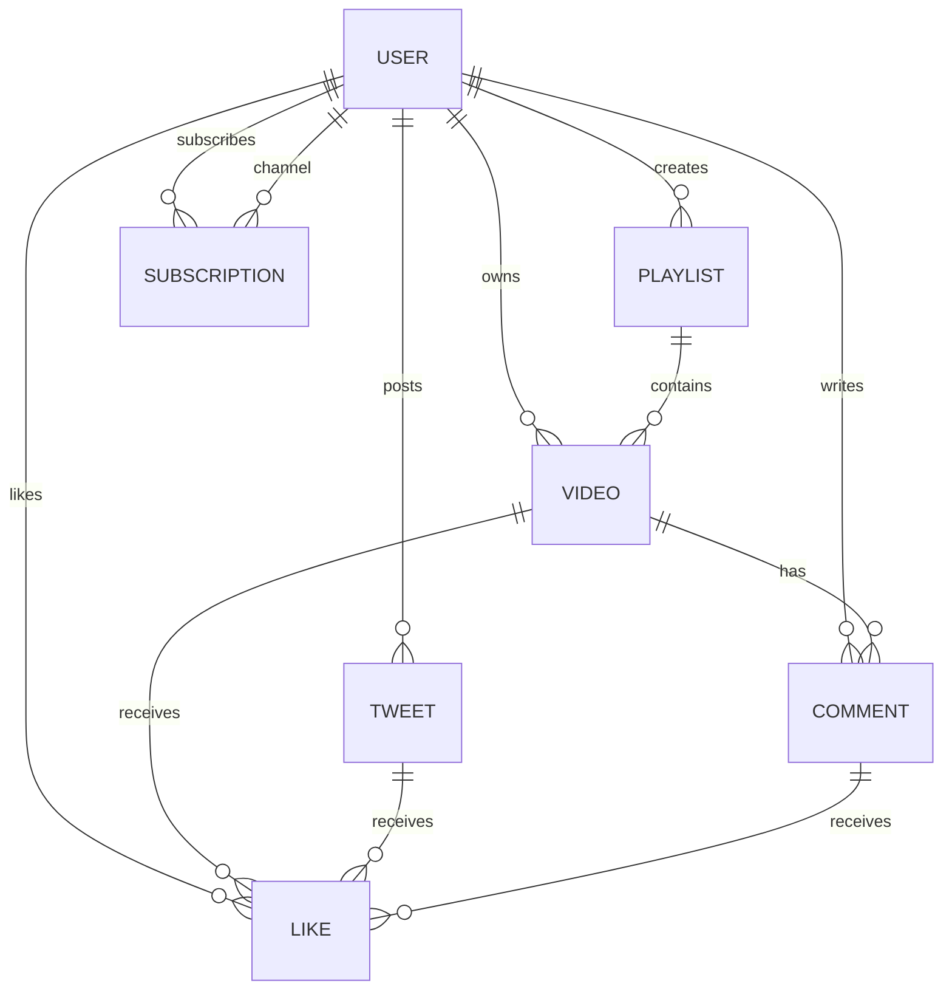

# 🎬 VideoTube — Backend API

A production-ready backend for a video hosting platform (like YouTube), built with **Node.js**, **Express**, and **MongoDB**. Features complete user authentication, video management, playlists, likes, comments, tweets, and subscriptions.

---

## 🚀 Features

- **User Authentication** — Register, login, logout with JWT access & refresh token flow
- **Video Management** — Upload, update, delete, and stream videos via Cloudinary
- **Comments** — Add, edit, and delete comments on videos
- **Likes** — Toggle likes on videos, comments, and tweets
- **Playlists** — Create, manage, and share video playlists
- **Subscriptions** — Subscribe/unsubscribe to channels, view subscriber lists
- **Tweets** — Create short text posts (community posts)
- **Watch History** — Automatically tracks viewed videos
- **Channel Profiles** — Aggregated subscriber counts, subscription status, and user info
- **Pagination** — Aggregate-based pagination for videos and comments

---

## 🏗️ Tech Stack

| Layer | Technology |
|---|---|
| Runtime | Node.js |
| Framework | Express.js v5 |
| Database | MongoDB + Mongoose |
| Authentication | JWT (Access + Refresh Tokens) |
| File Uploads | Multer (local) → Cloudinary (cloud) |
| Password Hashing | bcrypt |
| Dev Tooling | Nodemon, Prettier |

---

## 📁 Project Structure

```
backendChai/
├── public/                  # Static assets
├── uploads/                 # Temporary file uploads (before Cloudinary)
├── src/
│   ├── index.js             # Entry point — DB connection & server startup
│   ├── app.js               # Express app configuration & route mounting
│   ├── constants.js         # App constants (DB_NAME)
│   ├── controllers/         # Route handler logic
│   │   ├── user.controllers.js
│   │   ├── video.controllers.js
│   │   ├── comment.controllers.js
│   │   ├── like.controllers.js
│   │   ├── playlist.controllers.js
│   │   ├── subscription.controllers.js
│   │   └── tweet.controllers.js
│   ├── models/              # Mongoose schemas
│   │   ├── user.models.js
│   │   ├── video.models.js
│   │   ├── comment.models.js
│   │   ├── like.models.js
│   │   ├── playlist.models.js
│   │   ├── subscription.models.js
│   │   └── tweet.models.js
│   ├── routes/              # Express route definitions
│   │   ├── user.routes.js
│   │   ├── video.routes.js
│   │   ├── comment.routes.js
│   │   ├── like.routes.js
│   │   ├── playlist.routes.js
│   │   ├── subscription.routes.js
│   │   └── tweet.routes.js
│   ├── middlewares/
│   │   ├── auth.middlewares.js     # JWT verification middleware
│   │   └── multer.middlewares.js   # File upload middleware
│   ├── utils/
│   │   ├── ApiError.js        # Custom error class
│   │   ├── ApiResponse.js     # Standardized API response
│   │   ├── asyncHandler.js    # Async wrapper for route handlers
│   │   └── cloudinary.js      # Cloudinary upload utility
│   └── db/
│       └── index.js           # MongoDB connection logic
├── .env                     # Environment variables (not committed)
├── .env.sample              # Template for required env vars
├── .gitignore
├── .prettierrc
├── package.json
└── Readme.md
```

---

## ⚙️ Getting Started

### Prerequisites

- **Node.js** v18+
- **MongoDB** (local or Atlas cloud instance)
- **Cloudinary** account (for media uploads)

### 1. Clone the repository

```bash
git clone https://github.com/pankaj332004/backend.git
cd backend
```

### 2. Install dependencies

```bash
npm install
```

### 3. Configure environment variables

Create a `.env` file in the root directory based on `.env.sample`:

```env
PORT=8000
MONGODB_URI=mongodb+srv://your-connection-string
CORS_ORIGIN=*
ACCESS_TOKEN_SECRET=your-access-token-secret
ACCESS_TOKEN_EXPIRATION=1d
REFRESH_TOKEN_SECRET=your-refresh-token-secret
REFRESH_TOKEN_EXPIRATION=10d
CLOUDINARY_CLOUD_NAME=your-cloud-name
CLOUDINARY_API_KEY=your-api-key
CLOUDINARY_API_SECRET=your-api-secret
```

### 4. Run the development server

```bash
npm run dev
```

The server will start at `http://localhost:8000`.

---

## 📡 API Endpoints

All routes are prefixed with `/api/v1`.

### 👤 Users — `/api/v1/users`

| Method | Endpoint | Auth | Description |
|--------|----------|------|-------------|
| POST | `/register` | ❌ | Register a new user (with avatar & cover image) |
| POST | `/login` | ❌ | Login with email/username & password |
| POST | `/logout` | ✅ | Logout and clear tokens |
| POST | `/refresh-token` | ❌ | Refresh access token using refresh token |
| POST | `/change-password` | ✅ | Change current password |
| GET | `/current-user` | ✅ | Get logged-in user's profile |
| PATCH | `/update-account` | ✅ | Update fullName and email |
| PATCH | `/update-avatar` | ✅ | Update avatar image |
| PATCH | `/update-cover-image` | ✅ | Update cover image |
| GET | `/c/:username` | ✅ | Get channel profile with subscriber count |
| GET | `/history` | ✅ | Get watch history |

### 🎥 Videos — `/api/v1/videos`

| Method | Endpoint | Auth | Description |
|--------|----------|------|-------------|
| GET | `/` | ✅ | Get all videos (with search, sort, pagination) |
| POST | `/` | ✅ | Publish a new video (upload video + thumbnail) |
| GET | `/:videoId` | ✅ | Get video by ID (increments views) |
| PATCH | `/:videoId` | ✅ | Update video details (title, description, thumbnail) |
| DELETE | `/:videoId` | ✅ | Delete a video (owner only) |
| PATCH | `/toggle/publish/:videoId` | ✅ | Toggle video publish status |

### 💬 Comments — `/api/v1/comments`

| Method | Endpoint | Auth | Description |
|--------|----------|------|-------------|
| GET | `/:videoId` | ✅ | Get all comments for a video (paginated) |
| POST | `/:videoId` | ✅ | Add a comment to a video |
| PATCH | `/c/:commentId` | ✅ | Update a comment (owner only) |
| DELETE | `/c/:commentId` | ✅ | Delete a comment (owner only) |

### ❤️ Likes — `/api/v1/likes`

| Method | Endpoint | Auth | Description |
|--------|----------|------|-------------|
| POST | `/toggle/v/:videoId` | ✅ | Toggle like on a video |
| POST | `/toggle/c/:commentId` | ✅ | Toggle like on a comment |
| POST | `/toggle/t/:tweetId` | ✅ | Toggle like on a tweet |
| GET | `/videos` | ✅ | Get all liked videos |

### 📋 Playlists — `/api/v1/playlists`

| Method | Endpoint | Auth | Description |
|--------|----------|------|-------------|
| POST | `/` | ✅ | Create a playlist (with thumbnail) |
| GET | `/:playlistId` | ✅ | Get playlist by ID (with video details) |
| PATCH | `/:playlistId` | ✅ | Update playlist name/description |
| DELETE | `/:playlistId` | ✅ | Delete a playlist (owner only) |
| PATCH | `/add/:videoId/:playlistId` | ✅ | Add video to playlist |
| PATCH | `/remove/:videoId/:playlistId` | ✅ | Remove video from playlist |
| GET | `/user/:userId` | ✅ | Get all playlists of a user |

### 🔔 Subscriptions — `/api/v1/subscriptions`

| Method | Endpoint | Auth | Description |
|--------|----------|------|-------------|
| POST | `/c/:channelId` | ✅ | Toggle subscription to a channel |
| GET | `/c/:channelId` | ✅ | Get subscribers of a channel |
| GET | `/u/:subscriberId` | ✅ | Get channels a user has subscribed to |

### 📝 Tweets — `/api/v1/tweets`

| Method | Endpoint | Auth | Description |
|--------|----------|------|-------------|
| POST | `/` | ✅ | Create a new tweet |
| GET | `/user/:userId` | ✅ | Get all tweets of a user |
| PATCH | `/:tweetId` | ✅ | Update a tweet (owner only) |
| DELETE | `/:tweetId` | ✅ | Delete a tweet (owner only) |

---

## 🔐 Authentication

The API uses a **dual-token** strategy:

- **Access Token** — Short-lived, sent via cookie or `Authorization: Bearer <token>` header
- **Refresh Token** — Long-lived, stored in the database, used to generate new access tokens

Both tokens are set as **httpOnly, secure cookies** on login/refresh.

### Auth Flow
```
1. POST /register → Create account
2. POST /login → Receive access + refresh tokens (cookies)
3. Use access token for authenticated requests
4. POST /refresh-token → Get new access token when expired
5. POST /logout → Clear tokens
```

---

## 🧩 Data Models



---

## 🛡️ Error Handling

All errors follow a consistent format using the custom `ApiError` class:

```json
{
    "success": false,
    "message": "Error description",
    "errors": []
}
```

Successful responses use the `ApiResponse` class:

```json
{
    "statusCode": 200,
    "data": { ... },
    "message": "Success description",
    "success": true
}
```

---

## 👤 Author

**Pankaj Kumar Rajbhar**

---

## 📄 License

This project is licensed under the ISC License.
